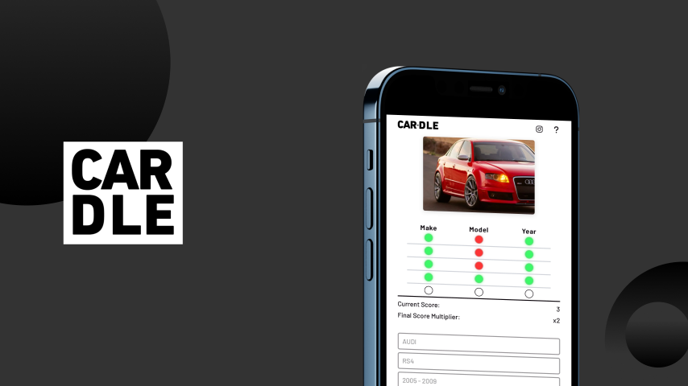

This is my unfiltered log of working on an online game Cardle. I was given the opportunity to build out a vision for a car guessing game for car enthusiasts, which would eventually be used and shared by real users. I saw this as a tall challenge, considering that I had only created personal projects for myself and simple replicas of real websites, such as an inventory management system and a website that used Google Map's API’s, both of which I could run seemlessly on my bugless localhost environment. This project would be used by users on different devices and browsers, which was a daunting prospect. I’ll save the detailed explanation of Cardle’s creation for another post, but in short, it's a progressive web app built with React (bundled with Vite) that consumes API endpoints from a Strapi backend, with both frontend and backend hosted on Heroku."

We’ve been collaborating on this project remotely for the past two years, both of us having other commitments. As the user base grew, the demand for additional features increased. The most recent major update to Cardle was adding user sign-ups and a leaderboard. Since then, traffic has surged significantly, with over 1000 registered users.
Life got in the way, and for the last month, Cardle was essentially collecting dust. I used to play it frequently, which was a good way to ensure everything was running smoothly and join the challenge of potentially topping the leaderboard. However, after a month of neglect, the same leaderboard seemed to be malfunctioning, and my game state synchronization was off. I was logged in, but it appeared that all my requests were unauthorized. We have a queue of changes to be made to Cardle, but this one immediately jumped to the front.
It turns out that the <abbr title = "JSON Web Tokens">JWT’s</abbr> were simply expired, and I only needed to log out and back in for them to refresh. Why wasn’t this refreshed automatically? This is the current task at hand. I’ll check back in once it’s resolved. 

Cardle has become a bit of a “code soup” problem. I’ve employed AI in some instances to generate code, and I've used it sparingly because, for me, it simply adds increased ambiguity. Every time I’m away from the code, I realize it takes longer and longer to become reacquainted with it. This blog is to help track my progress in becoming reacquainted with Cardle, documents it's new features/updates and fully take the reins of the code once more. 

My partner and I have zero expectations for this game but we both have an understanding that we want to create something fun, user friendly and reliable for car enthusiasts. Regardless of the outcome, one thing is certain: working on Cardle consistently has and will make me better at coding so stay tuned for the journey with Cardle and other future projects.

p.s. [playcardle.com](http://playcardle.com)